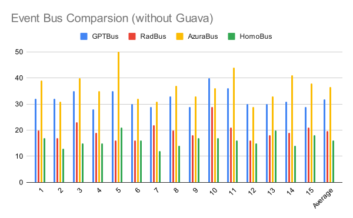

# GPTBus
## An event bus made by ChatGPT

The event bus was tested along side other buses.

* Each test was for 1 million iterations.
* Unit of measurement is in ms.

### Table of All results:

### Graph Without Google Guava or LWJEB

Interactive Chart: https://docs.google.com/spreadsheets/d/e/2PACX-1vQ5T4mEpH3JhBrPXZ1Xol8iN6Hp9Bu8u8LCsZ_79zjrnqiv2DjnCS0gwPksDnakV-iHg2n7uYfuzSaX/pubchart?oid=1180064623&format=interactive

### Graph With Google Guava and LWJEB

Interactive Chart: https://docs.google.com/spreadsheets/d/e/2PACX-1vQ5T4mEpH3JhBrPXZ1Xol8iN6Hp9Bu8u8LCsZ_79zjrnqiv2DjnCS0gwPksDnakV-iHg2n7uYfuzSaX/pubchart?oid=369240076&format=interactive
